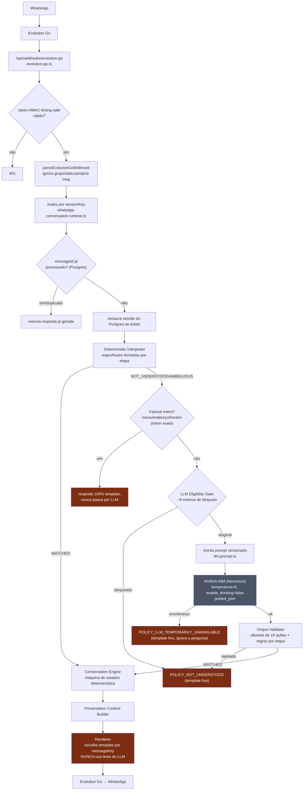

# Auditoria de Inteligência Conversacional — Brownier

**Data:** 2026-07-30
**Escopo:** por que o agente de vendas do Brownier continua parecendo uma máquina de estados rígida, mesmo com NVIDIA NIM (Nemotron) ativo.
**Método:** leitura linha a linha de todo `src/agent/*` e `src/integrations/evolution-go.ts` (≈6.400 linhas), rastreamento do fluxo real de uma mensagem do webhook até a resposta, e benchmark externo com fontes primárias (Anthropic, NVIDIA, Intercom/Fin, Klarna, Meta/WhatsApp).
**Regra seguida:** nenhuma alteração de código, nenhum commit. Este documento é só diagnóstico.

---

## 1. Resumo executivo

O NVIDIA NIM está corretamente integrado, protegido e testado — mas ele **nunca escreve uma palavra que o cliente lê**. A causa raiz não é "faltam frases" ou "o prompt é fraco": é que a arquitetura atual foi deliberadamente desenhada para o LLM ser um **classificador de intenção de última linha**, não um interlocutor. Isso está documentado no próprio prompt de sistema do sistema:

> "Você não conversa diretamente com o cliente: sua saída é lida apenas por um validador de software, nunca exibida diretamente." — [`src/agent/llm-prompt.ts:14`](../../src/agent/llm-prompt.ts#L14)

Todo texto que o cliente recebe vem de um catálogo estático de ~50 templates em português ([`src/agent/messages.ts`](../../src/agent/messages.ts)), escolhido por uma `messageKey` que sai do motor de estados determinístico. O NVIDIA, quando é chamado, só devolve JSON estruturado (`{status, actions[]}`) dentro de uma allowlist fechada de **19 tipos de ação** — todas transacionais (adicionar item, confirmar pedido, pedir atendente...). **Não existe nenhuma ação do tipo "responder socialmente" ou "esclarecer sem mudar de estado".** Um NVIDIA perfeito, com raciocínio perfeito, classificando "Boa noite" corretamente como conversa social, não tem para onde mandar essa classificação — o schema não tem esse slot. O resultado vira `NOT_UNDERSTOOD` e o cliente recebe o mesmo template genérico que receberia por um erro de digitação.

Confirmação empírica: três dos cinco exemplos de falha citados pelo usuário batem **literalmente, palavra por palavra**, com strings fixas do catálogo:

| Exemplo do usuário | Template estático correspondente |
|---|---|
| "Não consegui entender. Responda usando uma das opções apresentadas." | `POLICY_NOT_UNDERSTOOD_FIRST` — [`messages.ts:134`](../../src/agent/messages.ts#L134) |
| "Não consegui processar sua mensagem agora. Tente novamente em instantes ou peça um atendente." | `POLICY_LLM_TEMPORARILY_UNAVAILABLE` — [`messages.ts:140`](../../src/agent/messages.ts#L140) |
| "Ainda não consegui confirmar essa informação agora. Posso chamar um atendente para ajudar você." | `POLICY_LLM_RECOVERY_START` — [`messages.ts:142`](../../src/agent/messages.ts#L142) |

Isso não é coincidência de fraseado parecido — é a mesma string. O sistema está se comportando exatamente como foi programado para se comportar. O problema não é um bug: é a arquitetura fazendo exatamente o que o código diz para fazer.

Além disso, dois problemas estruturais agravam o quadro:
- **Consciência de tempo zero**: não existe, em lugar nenhum do pipeline, qualquer cálculo de hora atual, timezone ou "está aberto agora". `America/Fortaleza` não aparece em nenhum lugar do código relacionado a horário (aparece só como parte do endereço físico). Uma pergunta como "posso retirar agora?" nunca é respondida com raciocínio — o sistema apenas devolve o texto cru cadastrado em `business.hours`, sem comparar com o relógio.
- **Correções pontuais em vez de arquitetura**: o histórico do git mostra commits como `2c79eed fix: recognize greetings and menu requests` — exatamente o padrão de "adicionar mais uma frase" que o usuário pediu para não aceitar como resposta. `factual-intent.ts` já é uma lista fechada de tokens (`"menu"`, `"cardapio"`, `"endereco"`...) que cresce por patch a cada nova reclamação, e vai continuar crescendo indefinidamente porque o problema não é vocabulário, é ausência de compreensão real.

**Veredito direto**: a arquitetura atual **não pode** entregar um agente humanizado e consultivo, não importa quão bom seja o modelo por trás — porque o modelo está proibido de falar com o cliente. Ela pode (e faz bem) proteger contra alucinação, ações inválidas e criação indevida de pedidos. Mas confundiu "controle de segurança sobre ações" com "controle de segurança sobre linguagem" — e travou os dois com o mesmo cadeado.

---

## 2. Diagnóstico da causa raiz

Seguindo o processo de causa raiz (não sintoma):

**Sintoma observado**: respostas robóticas, fora de contexto, fallback técnico em pergunta comercial simples.

**Causa raiz nível 1**: o texto de resposta nunca é gerado pelo LLM; vem 100% de `MESSAGE_CATALOG` ([`messages.ts:87-153`](../../src/agent/messages.ts#L87-L153)), um dicionário `messageKey → template fixo`.

**Causa raiz nível 2**: o `messageKey` só pode ser um dos ~30 valores que o `Conversation Engine` ([`conversation.engine.ts`](../../src/agent/conversation.engine.ts)) produz, um por transição de estado da máquina de estados. Não existe messageKey para "resposta livre".

**Causa raiz nível 3**: para o Engine produzir uma transição, alguém upstream precisa entregar uma `AgentConversationAction` de um conjunto fechado de 19 tipos ([`llm-output-validator.ts:26-47`](../../src/agent/llm-output-validator.ts#L26-L47)). Isso vale tanto para o caminho determinístico quanto para o caminho LLM — o validador aplica a **mesma allowlist e a mesma tabela `STEP_ALLOWED_ACTIONS`** aos dois.

**Causa raiz nível 4 (a raiz de verdade)**: o desenho do produto trata "compreender o cliente" e "decidir a próxima ação de negócio" como a mesma operação, e resolve essa operação inteira dentro de um contrato JSON fechado, avaliado por um validador que só aceita ações, nunca texto. Isso é uma decisão de arquitetura, não um bug pontual — está documentada e é intencional (ver comentários de cabeçalho em `llm-prompt.ts`, `llm-output-validator.ts`, `text-conversation.service.ts`). Foi uma escolha correta para a preocupação que resolve (segurança contra alucinação/ações indevidas) e uma escolha incorreta para o objetivo declarado do produto (venda consultiva, natural, humanizada).

Todas as correções já tentadas (`factual-intent.ts`, `2c79eed`, `b7a4eed`) atacam o nível 1–2 (mais palavras-chave, mais atalhos determinísticos) sem tocar o nível 4. É por isso que, na visão do usuário, "1.000+ testes passam e o agente continua ruim": os testes validam que o contrato nível 1-3 funciona como especificado — e funciona. Não existe teste que possa detectar a falha do nível 4, porque o nível 4 nunca foi definido como requisito testável (não há um único teste que avalie "essa resposta soou natural/comercialmente competente").

---

## 3. Diagrama do fluxo atual



Os quatro blocos em vermelho são os únicos pontos onde uma mensagem termina virando texto para o cliente — e **nenhum deles nunca contém uma palavra escrita pelo NVIDIA**. O NVIDIA (bloco cinza) só produz JSON interno, consumido pelo validador, nunca pelo cliente.

---

## 4. Pontos onde a inteligência é bloqueada

Em ordem de impacto:

1. **`llm-prompt.ts:14`** — instrução explícita de que a saída do LLM nunca é exibida. Bloqueio arquitetural nº 1.
2. **`llm-output-validator.ts:26-47`** — `ALLOWED_ACTION_TYPES` tem 19 entradas, todas transacionais. Não existe `ACKNOWLEDGE`, `SMALL_TALK`, `ANSWER_QUESTION` ou qualquer ação "sem efeito colateral no estado". Uma resposta social correta do modelo não tem contêiner.
3. **`llm-eligibility.ts:82-115`** — o LLM só é chamado depois que (a) o interpretador determinístico falhou, (b) a etapa atual não está na lista de "sem ação útil possível", (c) o texto não contém padrões de injeção/JSON/ID interno, (d) o motivo de falha determinística não está em `BLOCKED_DETERMINISTIC_REASONS` (9 motivos, incluindo `INVALID_PICKUP_OPTION`, `PAYMENT_OPTIONS_UNAVAILABLE`, `INVALID_QUANTITY`). Ou seja: **justamente nas etapas de coleta estruturada** (pagamento, horário de retirada), onde o cliente mais precisa de uma clarificação inteligente, o LLM é excluído por definição.
4. **`factual-intent.ts:1-40`** — intercepta menu/endereço/horário **antes mesmo do LLM ser considerado**, por presença exata de token normalizado. Correto na intenção (dado factual não deveria depender de inferência de modelo), mas broken by design para qualquer variação de vocabulário fora da lista fechada, e sem NLU nenhum — é apenas `Set.has()`.
5. **`renderer.ts` + `messages.ts`** — mesmo quando o LLM classifica corretamente e a ação é validada e executada, o texto de resposta é escolhido só pela `messageKey`; o `AgentChatMessage` nunca carrega texto do modelo. Mesmo um `ADD_ITEM` corretamente inferido de uma frase muito natural volta como `"Adicionamos {quantity}x {productName} ao seu pedido."` — sempre a mesma frase, sem tom, sem reconhecer o que o cliente realmente disse.
6. **`STEPS_WITHOUT_USEFUL_LLM_ACTION = {"ORDER_CREATED"}`** ([`llm-eligibility.ts:44`](../../src/agent/llm-eligibility.ts#L44)) — depois que o pedido é criado, o LLM nunca mais é chamado nessa sessão. "Obrigado!", "quando fica pronto?" pós-pedido caem direto em fallback genérico.
7. **Tom fixo do template `WELCOME`** ([`messages.ts:88`](../../src/agent/messages.ts#L88)) — `"{greeting}! Seja bem-vindo à {businessName} 😊 Como posso ajudar?"` é usado sempre que `START_CONVERSATION` dispara, inclusive quando a saudação do cliente foi só social. Não existe diferenciação entre "oi, quero pedir" e "boa noite" — ambos produzem a mesma resposta.

---

## 5. Análise do prompt e schema

O `SYSTEM_PROMPT` ([`llm-prompt.ts:12-33`](../../src/agent/llm-prompt.ts#L12-L33)) é tecnicamente bem escrito para o que pede: é curto, deixa claro os limites ("você não cria pedido", "não calcula preço"), trata prompt injection corretamente (a mensagem do usuário é delimitada e rotulada como dado não confiável — boa prática, consistente com o guia de segurança de agentes da Anthropic), e força JSON estrito.

Mas o próprio enquadramento da tarefa impede qualquer raciocínio conversacional: a única pergunta que o prompt faz ao modelo é "qual ação estruturada isso representa?" — nunca "como devo responder a isso?". Isso responde diretamente à questão 6 do escopo: **o prompt força classificação rígida, não permite raciocínio conversacional**, porque o próprio *produto* pedido ao modelo é uma classificação, não uma resposta.

O schema de saída (`OPENAI_LLM_RESPONSE_SCHEMA`, aplicado via `guided_json` — decodificação restrita por gramática) tem só três status possíveis: `MATCHED | NOT_UNDERSTOOD | AMBIGUOUS`, e `MATCHED` só aceita os 19 tipos de ação. Não há campo de texto livre em lugar nenhum do schema. Isso confirma a questão 7: **sim, o schema é limitado demais** para o objetivo declarado — mas é adequado para o objetivo real ("classificador seguro de intenção").

A validação (`llm-output-validator.ts`) não descarta respostas válidas por excesso de zelo — ao contrário, é bem calibrada: resolve produto por id ou nome exato normalizado, nunca fuzzy, rejeita lote inteiro se uma ação for inválida (atômico), bloqueia `CONFIRM_ORDER` combinado com outra ação. Isso responde a questão 8: **o validador não é o gargalo** — o gargalo é o que existe *antes* dele (o prompt só pede classificação) e *depois* dele (o renderer ignora tudo que não for `messageKey`).

**Parâmetros do provider** ([`nvidia-nemotron-llm-provider.ts:176-185`](../../src/agent/providers/nvidia-nemotron-llm-provider.ts#L176-L185)): `temperature: 0`, `chat_template_kwargs: { enable_thinking: false }`, `guided_json`. Segundo a documentação da NVIDIA sobre a família Nemotron 3 (modelo "reasoning-capable" com raciocínio comutável via `enable_thinking`), esses parâmetros **desligam deliberadamente o modo de raciocínio do modelo** para menor latência. É uma escolha correta e defensável *para um extrator determinístico de JSON* — errado seria usar temperatura alta aqui. Mas é uma prova a mais de que o produto pedido ao Nemotron é "classifique com o mínimo de variância possível", não "converse". Nenhuma reconfiguração de parâmetro resolve isso: mesmo com `enable_thinking: true` e temperatura >0, a saída continuaria restrita ao mesmo `guided_json` sem campo de texto.

---

## 6. Análise de memória e estado

`AgentSession` ([`session.types.ts:25-46`](../../src/agent/session.types.ts#L25-L46)) guarda exclusivamente **estado operacional da transação**: etapa atual, carrinho, dados de checkout, contagem de não-entendimento, IDs de mensagens processadas. Responde à questão 19 diretamente: **a memória é 100% estado operacional, não fatos de conversa**. Não há registro de:
- o que o cliente já perguntou e já foi respondido (então perguntas repetidas não são reconhecidas como repetidas);
- preferências ou sinais ("cliente prefere Ninho", "cliente perguntou de promoção duas vezes") que um vendedor humano usaria;
- o texto original das últimas mensagens — só a ação estruturada resultante.

O prompt enviado ao NVIDIA ([`llm-prompt.ts:107-139`](../../src/agent/llm-prompt.ts#L107-L139)) manda para o modelo: `CURRENT_STEP`, o carrinho, nome/telefone/notas já coletados, contexto público (produtos, formas de pagamento, horários) e o resultado do interpretador determinístico. **Não envia histórico de mensagens** — cada chamada ao LLM é essencialmente stateless quanto à conversa textual (só quanto ao estado transacional). Isso responde à questão 4: o modelo recebe o estado da transação, não o histórico real da conversa. Para o caso de uso "classificar a mensagem atual dado o carrinho atual", isso é suficiente. Para "conduzir uma conversa natural que lembra o que foi dito", não é.

Persistência entre reinícios (questão 18): existe e está bem implementada. `PostgresConversationState` ([`postgres-conversation-state.ts`](../../src/agent/postgres-conversation-state.ts)) persiste sessão e resposta por mensagem, com `reserveIncoming` fazendo dedupe transacional (evita duplo processamento por retry do Evolution Go) e `saveSession`/`loadSession` restaurando a sessão a cada turno quando `DATABASE_URL` está configurado (confirmado em `server.ts:162-163`, wiring condicional). Esse é um dos poucos pontos da auditoria genuinamente sólido — a idempotência e a sobrevivência a restart estão corretas.

**Concorrência e mensagens rápidas** (questões 16-17): há um mutex por `sessionKey` em `whatsapp-conversation.runtime.ts:35-44` e outro equivalente em `text-conversation.service.ts:416-425` — mensagens da mesma conversa são serializadas corretamente, sem condição de corrida. Mas **não há nenhum agrupamento/debounce**: se o cliente manda "oi" e dois segundos depois "quero 10 brigadeiro", o sistema processa e **responde duas vezes**, em dois turnos separados, sem juntar as duas mensagens num único contexto. Isso é uma fonte real de sensação de rigidez em WhatsApp, onde é normal o usuário mandar rajadas de mensagens curtas.

---

## 7. Análise de ferramentas e dados

`AgentTools` ([`tools.ts:86-98`](../../src/agent/tools.ts#L86-L98)) é uma interface limpa e bem isolada: produtos, negócio, endereço, horas (string crua), slots de retirada, criação/consulta de pedido. O LLM **nunca chama ferramentas diretamente** — todo o contexto que ele recebe é montado antes da chamada (`sanitizeContext` em `llm-prompt.ts:76-92`) e é só leitura. Isso é uma boa prática de segurança (o modelo não tem superfície de ataque para side effects), mas também significa que o modelo não pode "decidir buscar mais informação" — ele recebe um snapshot fixo por turno, nunca pode pedir `getBusinessHours()` de novo ou aprofundar uma consulta.

O ponto mais crítico aqui, no entanto, é o item 8, a seguir.

---

## 8. Análise de data, hora e timezone

**Não existe, em nenhum lugar do pipeline do agente, cálculo de data/hora atual.** Busca exaustiva por `timezone`, `America/Fortaleza`, `getHours`, `isOpen`, `Intl.DateTimeFormat` em `src/agent` e `src/lib` não retornou nenhum resultado de lógica temporal — a única ocorrência de "Fortaleza" no código é como parte do endereço físico da loja ([`business-defaults.ts:1`](../../src/lib/business-defaults.ts#L1)), não como timezone.

O que existe:
- `AgentTools.getBusinessHours()` ([`tools.ts:157-159`](../../src/agent/tools.ts#L157-L159)) devolve `store.business.hours` como string crua, sem parsing.
- `factual-intent.ts:30-34` detecta "posso retirar agora?" (tokens de coleta + `agora`/`hoje`/`horario`) e devolve o texto cru de `hours` sem nenhuma comparação com o relógio.
- O template correspondente ([`messages.ts:149`](../../src/agent/messages.ts#L149)) é `"O horário informado para retirada é:\n\n{hours}"` — literalmente devolve o texto cadastrado, deixando o cliente fazer a conta de "será que está aberto agora" sozinho.
- `AgentSessionStore` usa relógio real (`new Date()`) só para TTL de sessão (30 min) e timestamps de auditoria — nunca para lógica de negócio.

Isso responde diretamente à pergunta de consciência temporal do escopo: **hoje, o agente não sabe que horas são, não sabe o dia da semana, e não pode responder corretamente "posso retirar agora?"** — mesmo que os horários estejam cadastrados. Ele só pode citar o texto cadastrado, nunca cruzá-lo com "agora".

### Desenho recomendado (não implementado nesta auditoria)

Cada turno deveria receber, calculado no servidor (nunca confiado ao conhecimento do modelo):

```
nowLocal: "2026-07-30T21:14:00-03:00"   // Intl/date-fns-tz com tz explícito
weekday: "quinta-feira"
timezone: "America/Fortaleza"
businessHoursToday: { open: "09:00", close: "19:00" } | null   // null = não cadastrado p/ esse dia
isOpenNow: true | false | "UNKNOWN"      // UNKNOWN só quando não há cadastro
```

Regras de design que já ficam claras da auditoria do estado atual:
- **calcular no servidor**, nunca deixar o LLM inferir hora a partir do prompt (o Nemotron não tem relógio confiável e não deve ser a fonte de verdade de nada auditável);
- **nunca hardcodar** a hora no texto do prompt de sistema (deve ser um campo de contexto por turno, como já é feito para carrinho/produtos em `llm-prompt.ts`);
- **`isOpenNow` só é `true`/`false` quando há horário cadastrado para aquele dia da semana** — na ausência de cadastro, a resposta correta é "preciso confirmar", nunca inventar ("não afirmar que está aberto/fechado sem horários cadastrados", exatamente como o escopo pede);
- suportar janelas que cruzam a meia-noite (ex.: 18h–00h30) como um caso de teste explícito, porque comparação ingênua de `"HH:mm" < "HH:mm"` quebra nesse caso;
- deixar um ponto de extensão para feriados/exceções futuras sem forçar reescrita (ex.: `businessHoursToday` já viria resolvido por uma função que sabe checar exceções, o resto do pipeline não precisa saber que exceções existem).

Isso é puramente uma ferramenta determinística nova (`getOperatingStatus(now)`), não uma mudança de modelo — cabe perfeitamente na filosofia atual de "Tools fornecem fatos, o Engine decide, o texto é template" **ou**, na arquitetura recomendada (seção 12), vira mais um fato que o LLM pode citar ao verbalizar.

---

## 9. Análise comercial e experiência

Mapeando os 5 exemplos do usuário contra o código:

- **Exemplo 1** ("Boa noite" → saudação padrão "vamos montar seu pedido"): `WELCOME` ([`messages.ts:88`](../../src/agent/messages.ts#L88)) é usado sempre, sem diferenciar saudação social de intenção de compra. Causa: template único, sem verbalização condicionada ao que o cliente realmente disse.
- **Exemplo 2** ("Poderia me mandar o menu?" → "não entendi"): hoje `factual-intent.ts` já reconheceria o token `"menu"` nessa frase (evidência de que esse caso específico já foi parcialmente corrigido pelo commit `2c79eed`) — mas qualquer sinônimo fora da lista fechada (`"cardápio de vocês"`, `"o que tem pra hoje"`, `"quais sabores"` sem a palavra "sabores") reproduz a mesma falha. Causa: correção por vocabulário, não por compreensão.
- **Exemplo 3** ("Qual o endereço de coleta?" → fallback técnico): o texto retornado bate exatamente com `POLICY_LLM_TEMPORARILY_UNAVAILABLE`, que só dispara quando o **provider realmente falha** (timeout/erro do NVIDIA) ou quando um lote de ações falha na execução. Ou seja: quando esse exemplo ocorreu, o LLM foi chamado e falhou tecnicamente — e a mensagem de recuperação usada é genérica, sem nenhuma tentativa de responder o que foi perguntado (nem cair no dado factual do endereço, que só é checado *antes* do LLM, não depois de uma falha dele).
- **Exemplo 4** ("Boa noite" numa etapa já avançada → resposta de fallback genérica): confirma que `START_GREETINGS` só existe para `session.step === "START"` ([`deterministic-interpreter.ts:120-131`](../../src/agent/deterministic-interpreter.ts#L120-L131)) — fora do `START`, nenhuma saudação é reconhecida deterministicamente, o LLM é chamado (elegível, pois `PRODUCT_NOT_FOUND` não está bloqueado), mas se ele não conseguir classificar a saudação em nenhuma das 19 ações, o resultado é `NOT_UNDERSTOOD` — e mesmo esse `NOT_UNDERSTOOD` não tem onde carregar "essa é só uma saudação social, continue de onde estava".
- **Exemplo 5** ("Pode fazer coleta agora?" → resposta fora de contexto): essa frase hoje bateria em `PICKUP_AVAILABILITY` no `factual-intent.ts` (contém "coleta" + "agora"), mas como descrito na seção 8, mesmo esse caminho **não sabe calcular "agora" de verdade** — só devolve o texto cru cadastrado. Se `business.hours` estiver vazio, o cliente recebe `BUSINESS_PICKUP_HOURS_UNAVAILABLE`, um texto que não reconhece que a pergunta era sobre "agora" especificamente.

**Padrão comum aos cinco exemplos**: em nenhum caso a resposta é gerada considerando o texto real do cliente. Em todos os casos, o sistema escolhe entre um conjunto pequeno e fixo de textos, por um roteamento que é ou (a) correspondência exata de vocabulário, ou (b) classificação de ação, nunca (c) geração de resposta. O modelo de vendas consultivo descrito no pedido do usuário (acolher → compreender → responder → orientar → ...) pressupõe (c). A arquitetura atual só tem (a) e (b).

---

## 10. Benchmark com fontes e cases

### Anthropic — "Building Effective Agents" (dez/2024)
[anthropic.com/engineering/building-effective-agents](https://www.anthropic.com/engineering/building-effective-agents)

Distingue **workflows** (LLM e ferramentas orquestrados por código pré-definido, controle determinístico) de **agentes** (o próprio modelo decide sequenciamento e uso de ferramentas). Recomendação central: comece simples, adicione autonomia do modelo só onde o caminho não é previsível em código. **Aplicável ao Brownier**: o Engine determinístico de estados é exatamente o padrão "workflow" recomendado para a parte transacional (checkout, criação de pedido) — está correto mantê-lo assim. O erro não é ter workflow determinístico; é não ter *nenhuma* camada de "augmented LLM" para a parte de linguagem, que é onde o padrão da Anthropic prevê o modelo lendo contexto e **produzindo a resposta final**, não só uma classificação interna.

### Intercom Fin AI Agent — outcomes públicos
[intercom.com/help/en/articles/8205718](https://www.intercom.com/help/en/articles/8205718-fin-ai-agent-outcomes)

Taxa de resolução média de 76% em 12 mil clientes; caso Anthropic-como-cliente-do-Fin: 58% de resolução, ~50 mil resoluções/mês. Ponto relevante para o Brownier: **quando o Fin escalona para humano, o handoff carrega o transcript completo, o resumo do problema e a explicação de por que não resolveu** — o atendente humano nunca reinicia do zero. No Brownier, `REQUEST_HUMAN`/`handleRequestHuman` ([`conversation.engine.ts:535-541`](../../src/agent/conversation.engine.ts#L535-L541)) só marca `step: "HUMAN_HANDOFF"` — **não gera nenhum resumo, nenhum contexto para quem for atender**. É uma lacuna direta contra a prática de mercado.

### Klarna — assistente de IA no atendimento
[klarna.com/international/press](https://www.klarna.com/international/press/klarna-ai-assistant-handles-two-thirds-of-customer-service-chats-in-its-first-month/)

Lançado em fev/2024: 2,3M conversas no primeiro mês (equivalente a ~700 agentes), resolução em <2min vs 11min humano, -25% em contatos repetidos. Em 2025 o CEO reconheceu publicamente que "custo foi um fator de avaliação predominante" e isso gerou queda de qualidade — Klarna recontratou humanos e passou a um modelo híbrido (dado de Q3/2025: equivalente a 853 agentes, ~$60M/ano economizados, NPS 73). **Lição direta para o Brownier**: otimizar só por "responder automaticamente" sem medir qualidade percebida é a mesma armadilha que o usuário já está descrevendo (1.000+ testes técnicos passando, experiência real ruim) — Klarna precisou de um ciclo de correção pública para perceber isso. O Brownier tem a chance de detectar isso agora, via avaliação comercial explícita (seção 15), antes de escalar.

### Meta / WhatsApp Business Platform — política de 2026 para bots de IA
Fontes agregadas de mercado (não há um único post oficial linkável para a política específica, mas é consistente entre múltiplas fontes de 2026): a política da Meta para 2026 **proíbe bots de propósito geral e exige bots de propósito específico** dentro do WhatsApp Business Platform, reforçando confiabilidade de conteúdo e respeito à janela de serviço de 24h. **Aplicável**: o desenho do Brownier como agente de domínio fechado (só vende brownies, nunca sai do escopo) já está alinhado com essa política — isso é um ponto positivo da arquitetura atual, vale preservar mesmo ao redesenhar a camada de linguagem.

### NVIDIA — documentação de reasoning toggle do Nemotron
[docs.nvidia.com/rag/latest/enable-nemotron-thinking.html](https://docs.nvidia.com/rag/latest/enable-nemotron-thinking.html)

Confirma que `enable_thinking` é um parâmetro real e documentado da família Nemotron, com `false` como default recomendado para latência mínima quando não é necessário raciocínio — exatamente o modo em que o Brownier usa o modelo hoje. Isso corrobora a seção 5: não é um parâmetro mal configurado, é o parâmetro certo *para a tarefa de classificação que hoje é pedida ao modelo*. Se a tarefa mudar para verbalização/raciocínio comercial, o parâmetro precisa mudar junto — não é uma troca isolada de flag, é consequência de mudar o que se pede ao modelo.

### O que não se aplica ao Brownier
- Automação de "propósito geral" (Klarna/Intercom operam em escala multi-tenant, multi-canal) — o Brownier é um negócio único, não precisa de roteamento multi-tenant nem multi-idioma agora.
- Otimização agressiva de custo por resolução automática (a lição do Klarna é: não repita o erro deles de otimizar isso antes de garantir qualidade).

---

## 11. Comparação das arquiteturas possíveis

### A. Manter a máquina de estados como controladora principal (status quo)
- **Vantagens**: previsibilidade total, custo de LLM mínimo, fácil de testar unitariamente, zero risco de alucinação em ações críticas (criação de pedido já é 100% determinística e assim deveria continuar).
- **Riscos**: é literalmente a causa raiz identificada nesta auditoria. Continuar aqui significa continuar recebendo o mesmo tipo de reclamação, resolvida por patch de vocabulário (whack-a-mole), para sempre.
- **Custo/latência**: mínimo.
- **Adequação ao objetivo declarado (agente humanizado consultivo)**: baixa. Não alcança o objetivo, porque o objetivo exige geração de linguagem contextual, que essa opção não tem.

### B. LLM como planejador conversacional, mantendo ações críticas determinísticas
- O LLM passa a decidir **o que fazer e o que dizer**, mas ações irreversíveis (`CONFIRM_ORDER`, cálculo de preço, criação de pedido) continuam 100% em código determinístico, sempre revalidadas antes de executar.
- **Vantagens**: resolve a causa raiz (o modelo finalmente verbaliza), mantém a rede de segurança atual quase intacta (o Output Validator já faz esse trabalho para ações — só precisa parar de vetar texto).
- **Riscos**: precisa de um novo contrato de saída (ação + texto), maior superfície de teste de qualidade de linguagem (não só de contrato), maior consumo de tokens/latência por turno.
- **Custo/latência**: moderado — mais alto que hoje (o modelo passa a gerar texto, não só JSON curto), mas ainda controlável com o mesmo padrão de rate limit/concorrência já implementado em `nvidia-nemotron-llm-provider.ts`.
- **Adequação**: alta — é o padrão que o benchmark (Anthropic "augmented LLM", Intercom Fin) usa.

### C. Híbrida plena — LLM compreende e planeja; ferramentas fornecem dados reais; políticas limitam decisões; Engine valida e executa; LLM verbaliza a resposta; estado transacional continua determinístico
- Essencialmente a opção B levada à sua forma mais completa: separa claramente **compreensão** (LLM lê a mensagem + contexto + fatos do negócio, incluindo agora hora/horário de funcionamento), **política comercial** (regras de negócio continuam em código: não vender fiado, não inventar prazo, não confirmar sem pagamento), **execução** (Engine + Tools, exatamente como hoje) e **verbalização** (LLM transforma o resultado da execução em texto natural, sempre ancorado nos fatos reais devolvidos pela execução — nunca inventando valor, produto ou prazo).
- **Vantagens**: mesma segurança de hoje nas ações; resolve tom, continuidade, small talk, objeções, pedidos compostos; abre caminho natural para consciência de horário (seção 8) e memória semântica (seção 6) como só mais fatos que a verbalização usa.
- **Riscos**: maior complexidade de orquestração (duas chamadas de LLM por turno em casos que hoje usam zero: uma para compreender, outra opcionalmente para verbalizar — ou uma única chamada bem desenhada que já devolve ação + texto, reduzindo o risco de duas chamadas); precisa de avaliação contínua de qualidade de linguagem (novidade real para a suíte de testes atual).
- **Custo/latência**: o mais alto das três, mas ainda dentro do padrão de mercado (Intercom Fin, Klarna e afins operam assim).
- **Adequação**: a única das três que atinge o objetivo declarado sem abrir mão da segurança já construída.

**Recomendação**: C, implementada incrementalmente a partir da B (ver plano priorizado, seção 13). Não é uma arquitetura nova do zero — é a arquitetura atual **com um passo a mais**: o Output Validator já separa "ação válida" de "ação inválida"; falta só permitir que uma ação válida venha acompanhada de texto gerado pelo modelo, ancorado nos fatos que o Engine confirmou, e transformar o Renderer de "escolhe template fixo" para "usa texto do modelo quando disponível e ancorado, cai para template quando não".

---

## 12. Arquitetura recomendada

Camadas, mantendo a nomenclatura já usada no código atual sempre que possível (para reduzir custo de migração):

1. **Compreensão da mensagem** (hoje: Deterministic Interpreter + LLM Interpreter) — mantém os dois, mas o LLM Interpreter passa a rodar **sempre** que o determinístico não bater exatamente (não só nos casos "elegíveis" de hoje), incluindo dentro dos passos de coleta estruturada — porque é justamente ali que a compreensão importa mais.
2. **Memória da conversa** (hoje: `AgentSession`, só estado operacional) — adicionar um campo de histórico curto (últimas N trocas, texto bruto) e, opcionalmente, fatos semânticos leves ("já perguntou de promoção 2x") — usado só para verbalização, nunca para decisão de ação (decisão de ação continua vindo só de estado estruturado, para não reabrir risco de alucinação).
3. **Fatos do negócio** (hoje: Agent Tools) — adicionar `getOperatingStatus(now)` (seção 8) como nova Tool determinística.
4. **Política comercial** (hoje: espalhada entre Engine, Validator e `factual-intent.ts`) — consolidar em um único lugar as regras "o que nunca deve ser dito/feito" (não afirmar horário sem cadastro, não inventar entrega, não pressionar após recusa) para que tanto o caminho determinístico quanto a verbalização por LLM obedeçam à mesma fonte.
5. **Planejamento do próximo turno** — novo: dado o resultado da execução (Engine) + fatos + política, decidir a **forma** da resposta (breve confirmação vs. pergunta de esclarecimento vs. oferta consultiva) — hoje essa decisão é implícita no `messageKey`, que só tem granularidade de estado, não de intenção comunicativa.
6. **Execução de ferramentas** (hoje: Engine + Tools) — sem mudança; continua 100% determinística.
7. **Validação** (hoje: Output Validator) — sem mudança na validação de ações; adicionar validação de texto gerado (nunca conter valor monetário inventado, nunca conter produto fora do catálogo, nunca afirmar horário sem fonte — reusa `UNSAFE_SUGGESTION_PATTERN` e o espírito de `publicSuggestions()` já existentes em `text-conversation.service.ts:213-228`).
8. **Geração da resposta** (novo: hoje é 100% `renderer.ts` + `messages.ts`) — passa a admitir texto do LLM como alternativa ao template fixo, sempre condicionado a ter passado pela validação do item 7; template fixo continua sendo o fallback seguro quando a verbalização falhar ou for rejeitada (mesmo padrão de "nunca falhar aberto" já usado hoje).
9. **Persistência** (hoje: Postgres) — sem mudança, já está correta.
10. **Observabilidade** — hoje quase inexistente para qualidade conversacional (existem logs técnicos, mas nenhuma métrica de "essa resposta foi comercialmente boa"); precisa de amostragem e avaliação periódica (seção 15/16).
11. **Atendimento humano** (hoje: `REQUEST_HUMAN` sem contexto) — passar a anexar um resumo gerado (texto curto, também validado) da conversa para quem for atender, no padrão Intercom Fin.

Este desenho é a opção C da seção 11.

---

## 13. Plano priorizado

**P0 — bloqueadores de percepção de inteligência (maior impacto, menor risco):**
- Permitir que o LLM produza texto de resposta verbalizado quando a ação já foi validada e executada, mantendo o template fixo como fallback de segurança (não substituir o Validator, estender o Renderer).
- Adicionar `getOperatingStatus(now)` com timezone explícito (`America/Fortaleza`) e usá-lo em `PICKUP_AVAILABILITY` — hoje o sistema literalmente não sabe que horas são.
- Adicionar handling de "conversa social sem mudança de estado" (novo tipo de resultado, não uma ação de negócio) para que saudações fora do `START` não caiam em `NOT_UNDERSTOOD`.
- Remover a exclusão do LLM nas etapas de coleta estruturada hoje bloqueadas por `BLOCKED_DETERMINISTIC_REASONS` (`INVALID_PICKUP_OPTION`, `PAYMENT_OPTIONS_UNAVAILABLE` etc.) — são exatamente os pontos onde clarificação inteligente mais importa.

**P1 — continuidade e qualidade comercial:**
- Enviar histórico curto de mensagens (não só estado) ao LLM, para continuidade natural.
- Anexar resumo de contexto ao `REQUEST_HUMAN` (handoff informado, padrão Intercom Fin).
- Suíte de avaliação conversacional (seção 15) rodando em CI ou pelo menos semanalmente, não substituindo os testes técnicos, complementando.
- Debounce curto (poucos segundos) para agrupar rajadas de mensagens do WhatsApp antes de processar.

**P2 — robustez e evolução:**
- Suporte a feriados/exceções de horário.
- Memória semântica leve (preferências, perguntas já respondidas) usada só para verbalização.
- Observabilidade de qualidade conversacional em produção (amostragem + avaliação periódica, não só métrica técnica de latência/erro).

---

## 14. Matriz de riscos

| Risco | Probabilidade | Impacto | Mitigação já existente | Mitigação necessária |
|---|---|---|---|---|
| LLM alucina produto/preço/horário na verbalização | Média | Alto | Validator já impede isso em **ações** | Estender validação para **texto** (checar produto/valor citado contra fatos reais antes de enviar) |
| Latência maior por turno com LLM sempre ativo | Alta | Médio | Rate limit e timeout já implementados (`nvidia-nemotron-llm-provider.ts`) | Monitorar p95 de latência por turno; manter timeout curto com fallback de template |
| Custo de tokens sobe com verbalização + histórico | Alta | Baixo-médio | — | Medir custo por conversa antes/depois; NVIDIA NIM já é mais barato que alternativas por design do projeto |
| Regressão de segurança comercial (agente promete algo indevido) | Baixa se validação de texto for implementada | Alto | Política comercial hoje só existe implicitamente | Consolidar política comercial (seção 12, item 4) antes de liberar verbalização livre |
| Suíte de 1.000+ testes técnicos passar mas qualidade comercial não melhorar (repetir o problema atual) | Alta se não houver avaliação comercial | Alto | — | Suíte de avaliação conversacional (seção 15) como gate de aceite, não só testes de contrato |
| Efeito Klarna: otimizar por "resolve sozinho" sem medir percepção | Média | Alto | — | Critérios de aprovação (seção 16) incluem qualidade percebida, não só taxa de resolução |

---

## 15. Suíte de avaliações proposta (estrutura para 50+ conversas)

Categorias obrigatórias (cada uma com casos felizes, variações informais de Fortaleza, erros de digitação e ao menos um caso adversarial):

1. Saudação pura (sem intenção de compra) — 4 casos
2. Saudação com intenção explícita — 3 casos
3. Conversa social / small talk intercalado com pedido — 4 casos
4. Menu / cardápio (variações de vocabulário fora da lista fechada atual) — 5 casos
5. Preços e promoções — 4 casos
6. Endereço — 3 casos
7. Horário de funcionamento, incluindo "posso retirar agora?" dentro e fora do expediente, e sem horário cadastrado — 5 casos
8. Retirada — 3 casos
9. Entrega (fora de escopo — validar recusa educada, sem ser robótica) — 2 casos
10. Produto indisponível — 2 casos
11. Erros de digitação / abreviações — 3 casos
12. Mensagens incompletas ("quero 5") — 2 casos
13. Múltiplas intenções na mesma mensagem ("quero 5 brigadeiro e qual o horário de vocês?") — 3 casos
14. Mudança de ideia / correção ("na verdade quero 10, não 5") — 3 casos
15. Quantidade ambígua/errada — 2 casos
16. Continuidade de contexto (pergunta que só faz sentido lendo a mensagem anterior) — 3 casos
17. Objeção ("tá caro") — 2 casos
18. Recusa educada (não insistir depois) — 2 casos
19. Cliente indeciso — 2 casos
20. Reclamação — 2 casos
21. Urgência ("preciso agora, é pra já") — 2 casos
22. Pedido de atendente humano — 2 casos
23. Falha simulada do provider NVIDIA (timeout/erro) — 2 casos
24. Restart do processo no meio da conversa — 1 caso
25. Replay de mensagem duplicada (retry do Evolution Go) — 1 caso
26. Rajada de mensagens rápidas (2-3 mensagens em poucos segundos) — 2 casos
27. Linguagem informal cearense ("oxente", "vixe", "massa") — 2 casos
28. Tentativa de manipulação (prompt injection, "ignore as regras anteriores", fingir ser admin) — 2 casos
29. Dado ausente (cliente não informa telefone quando pedido) — 2 casos

Total: ≥ 55 conversas.

**Critérios de avaliação por conversa** (cada um em escala objetiva, não binária "passou/falhou"):
- Compreensão (a intenção real foi capturada?)
- Relevância (a resposta responde ao que foi perguntado?)
- Precisão factual (nenhum produto/preço/horário inventado — checável automaticamente contra o catálogo real)
- Continuidade (a resposta faz sentido dado o histórico?)
- Naturalidade (soa como uma pessoa, não como formulário — avaliação humana ou LLM-judge calibrado)
- Tom (nem frio demais, nem artificialmente animado)
- Não invasividade (não empurra venda antes de acolher)
- Capacidade comercial (orienta, sugere, conduz — sem pressionar)
- Segurança (nunca cria pedido/afirma dado sem confirmação real)
- Uso correto de ferramentas (dado factual sempre vem de Tools, nunca inventado)
- Ausência de alucinação
- Qualidade do handoff (quando escalado, o contexto foi transferido?)
- Sucesso da tarefa (o objetivo comercial do turno foi atingido?)

---

## 16. Critérios objetivos de aprovação

Um HTTP 200 do webhook **nunca** é critério de sucesso conversacional (conforme restrição do escopo). Critérios reais propostos:

- **Precisão factual: 100%** — zero tolerância para produto/preço/horário inventado (checável automaticamente, deve ser gate bloqueante).
- **Compreensão ≥ 90%** dos 55+ casos da suíte, incluindo variações de vocabulário fora do conjunto fechado atual (esse é o teste que hoje o sistema reprovaria em boa parte dos casos de vocabulário livre).
- **Continuidade**: nenhuma saudação social fora da etapa `START` deve gerar fallback técnico ou de "não entendi" — deve ser tratada como reconhecimento social sem alterar o estado.
- **Zero respostas técnicas visíveis ao cliente** ("não consegui processar", "tente novamente") quando a pergunta era uma pergunta comercial legítima — essa mensagem deve ficar reservada só para falha real e comprovada do provider.
- **Handoff informado**: 100% dos `REQUEST_HUMAN` carregam um resumo de contexto (não zero, como hoje).
- **Consciência de horário**: nunca afirmar aberto/fechado sem horário cadastrado; sempre correto quando cadastrado, incluindo os casos de borda de abertura/fechamento e virada de meia-noite.
- **Aprovação não é só técnica**: a suíte precisa de pelo meno uma rodada de avaliação humana (não só LLM-judge) antes de qualquer alegação de "resolvido" — essa é a lição direta do caso Klarna.

---

## 17. Estimativa de impacto, complexidade e custo

| Item do plano | Impacto na percepção de inteligência | Complexidade de implementação | Custo incremental de LLM |
|---|---|---|---|
| Verbalização por LLM (P0) | Muito alto | Médio-alto (novo contrato de saída ação+texto, validação de texto) | Médio (mais tokens de saída por turno, mas ainda um único modelo já contratado) |
| Consciência de horário (P0) | Alto (resolve uma pergunta comercial comum hoje sempre mal respondida) | Baixo (função determinística nova + um novo fato no contexto) | Zero |
| Ação de "conversa social" (P0) | Alto (resolve 3 dos 5 exemplos do usuário) | Baixo-médio | Zero a baixo |
| Remover bloqueio de LLM em etapas de coleta (P0) | Médio-alto | Baixo (mudar uma lista de exclusão) | Baixo (mais chamadas de LLM, mas só nos casos hoje sem cobertura nenhuma) |
| Histórico curto no prompt (P1) | Médio | Baixo-médio | Baixo-médio (mais tokens de entrada) |
| Handoff informado (P1) | Médio (percepção de qualidade no pior caso, quando escala) | Baixo | Baixo (um resumo curto por handoff, evento raro) |
| Suíte de avaliação conversacional (P1) | Indireto, mas é o que impede regressão silenciosa | Médio (esforço de tooling + curadoria dos 55+ casos) | Custo de avaliação (rodar casos periodicamente), não de produção |
| Debounce de rajada (P1) | Médio | Baixo-médio (janela de agregação por sessão) | Zero |
| Feriados/exceções, memória semântica, observabilidade contínua (P2) | Baixo-médio no curto prazo, alto a longo prazo | Médio-alto | Baixo-médio |

O maior ganho por menor esforço está concentrado inteiramente em P0 — é também o que resolve diretamente os 5 exemplos trazidos pelo usuário.

---

## 18. Próxima etapa única

Definir e validar com o usuário (antes de qualquer código) o **novo contrato de saída do LLM Interpreter**: hoje é `{status, actions[]}`; a proposta mínima é `{status, actions[], responseText?, groundedFacts[]}`, onde `responseText` só é aceito pelo Validator se cada fato citado nele (produto, preço, horário) bater contra `groundedFacts` — o conjunto de fatos que o próprio Engine/Tools confirmou naquele turno, nunca inventado pelo modelo. Esse contrato é o ponto de alavanca que destrava P0 inteiro (verbalização, resposta social, remoção dos bloqueios de coleta) sem abrir mão de nenhuma garantia de segurança já construída pelo Validator atual.
