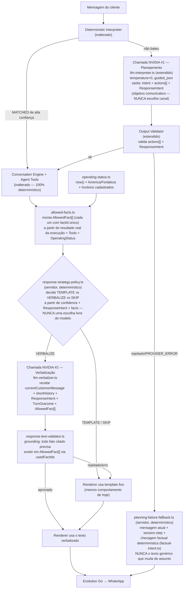

# Especificação Técnica — Arquitetura Híbrida de Conversação (Brownier)

**Data:** 2026-07-30
**Baseado em:** [`docs/audits/2026-07-30-conversational-intelligence-audit.md`](../audits/2026-07-30-conversational-intelligence-audit.md) — seções 11.C e 12.
**Escopo:** especificação apenas. Nenhum código foi alterado, nenhum commit, push, deploy ou mudança de infraestrutura (Railway, Postgres, Evolution Go) neste documento.

## Problema confirmado (recapitulação da auditoria)

O NVIDIA NIM hoje só classifica; nunca verbaliza (`llm-prompt.ts:14` diz isso explicitamente). O cliente recebe sempre um template fixo de `messages.ts`, escolhido por uma `messageKey` de uma máquina de estados que não tem slot para "resposta social" ou "esclarecimento natural". Não existe consciência real de data/hora — `America/Fortaleza` só aparece como parte do endereço físico, nunca como timezone de cálculo.

## Princípios inegociáveis desta especificação

1. **Fatos nunca são criados pelo modelo.** Todo preço, produto, endereço e horário citado numa resposta gerada por IA precisa vir de um `AllowedFact` computado pelo servidor — nunca inferido, arredondado ou "lembrado" pelo modelo.
2. **Ações transacionais continuam 100% determinísticas.** `conversation.engine.ts` não muda. Criar pedido, calcular preço, validar horário de retirada continuam em código, nunca em um LLM.
3. **`America/Fortaleza` é o timezone de cálculo**, sempre resolvido no servidor via relógio real (`now()`), nunca inferido pelo modelo.
4. **Nunca afirmar aberto/fechado sem horário cadastrado.** Ausência de cadastro é um estado de primeira classe (`OperatingStatus.known === false`), não um `null` silencioso.
5. **Template é sempre o fallback seguro — em qualquer ponto de falha, não só na verbalização.** Toda verbalização tem, ao lado, o `messageKey` do template equivalente já calculado. Se a verbalização falhar, for rejeitada, ou o provider cair, o template dispara. E se o **próprio planejamento** (chamada #1) falhar, o fallback ainda assim é calculado de forma contextual — nunca um texto genérico desconectado da pergunta (ver princípio 8).
6. **PostgreSQL, Evolution Go, webhook e idempotência não mudam.** Esta especificação é inteiramente interna a `src/agent/*`.
7. **A escolha do canal de resposta é sempre do servidor, nunca do modelo.** O modelo (chamada #1) só expressa `intent`, `actions[]` e um objetivo comunicativo (`ResponseIntent`). Decidir se a resposta sai como template fixo, como texto verbalizado (chamada #2), ou se a chamada #2 nem é feita, é uma política determinística do servidor — nunca um valor que o próprio NVIDIA escolhe livremente.
8. **Fallback nunca muda de assunto, mesmo quando o planejamento falha.** Quando a chamada #1 falha ou é rejeitada, o servidor calcula um fallback contextual a partir da mensagem atual, do estado da sessão, de uma checagem factual determinística (mesma lógica de `factual-intent.ts`) e da etapa atual do pedido — nunca um texto genérico e desconectado da pergunta.
9. **Histórico curto nunca é fonte de fato.** `shortHistory` (que inclui a mensagem atual) serve só para resolver referências ("esse", "agora", "o segundo"), continuidade, correções e respostas sociais — nunca para afirmar preço, produto, endereço ou horário. Esses só podem vir de `AllowedFact`.

---

## 1. Fluxo alvo



O caminho determinístico de alta confiança (ex.: `"2"` para adicionar o item 2 do menu) **não muda em nada** — continua sem chamar nenhum LLM, exatamente como hoje. As duas chamadas ao NVIDIA só entram quando o determinístico não resolve, que é justamente onde a auditoria encontrou os cinco exemplos de falha. Em nenhum dos dois pontos de decisão (`response-strategy-policy.ts` e `planning-failure-fallback.ts`) o modelo escolhe o próprio destino — ele só informa o que entendeu; quem decide o que fazer com isso é sempre código determinístico do servidor.

---

## 2. Contratos TypeScript

Os tipos abaixo são a especificação da interface entre camadas — não é código para colar direto (nomes de arquivo/import serão decididos na implementação), mas os campos, uniões e nomes aqui são o contrato que todas as tasks do plano (seção 6) devem respeitar.

### `ConversationIntent`

```typescript
// Classificação de alto nível da mensagem, produzida pelo planejamento.
// Não é a ação de negócio (isso é ConversationPlan.actions) — é o "tipo
// comunicativo" da mensagem, usado para decidir se existe ação nenhuma a
// executar e que tipo de resposta faz sentido.
type ConversationIntent =
  | "BUSINESS_ACTION"      // mapeia para 1+ AgentConversationAction
  | "SOCIAL"                // saudação, agradecimento, small talk sem ação
  | "FACTUAL_QUESTION"      // pergunta objetiva: endereço, horário, menu, preço
  | "CLARIFICATION_NEEDED"  // ambíguo, mais de uma leitura plausível
  | "OUT_OF_SCOPE"          // fora do domínio (entrega, assunto não relacionado)
  | "OBJECTION"             // hesitação/objeção de preço, sem pedir ação
  | "UNRECOGNIZED";         // nada do acima — único caso que ainda vira NOT_UNDERSTOOD puro
```

### `ResponseIntent`

```typescript
// Objetivo comunicativo do turno de resposta, informado pelo modelo na
// chamada #1 — NUNCA uma decisão de canal. ResponseIntent diz "o que este
// turno precisa comunicar" (reconhecer socialmente, responder um fato,
// confirmar uma ação, pedir esclarecimento, sugerir, recusar). Decidir SE
// isso vira template fixo, verbalização (chamada #2), ou nenhuma chamada
// ao modelo é responsabilidade exclusiva de `response-strategy-policy.ts`
// (servidor, determinístico — ver seção 2.1). Por isso não existe (e não
// pode existir) uma variante "USE_TEMPLATE" aqui: isso seria o modelo
// escolhendo o próprio canal de saída, o que o item 3 das correções
// obrigatórias proíbe explicitamente.
type AllowedFactKey =
  | "PRODUCT"
  | "CART_SUMMARY"
  | "ORDER_CONFIRMATION"
  | "BUSINESS_ADDRESS"
  | "OPERATING_STATUS"
  | "PICKUP_SLOTS"
  | "PAYMENT_OPTIONS"
  | "MISSING_FIELDS"
  | "ORDER_FAILURE_REASON";

type ResponseIntent =
  | { kind: "SOCIAL_ACK" }
  | { kind: "ANSWER_FACTUAL"; factKeys: AllowedFactKey[] }
  | { kind: "CONFIRM_ACTION_RESULT" }
  | { kind: "ASK_CLARIFICATION"; ambiguityReason: string }
  | { kind: "OFFER_SUGGESTION"; productIds: string[] }
  | { kind: "DECLINE_OUT_OF_SCOPE" };
```

### 2.1 `RenderStrategy` — a decisão de canal, sempre do servidor

```typescript
// Única peça do pipeline que decide "template, verbalizar, ou nem chamar
// o modelo #2". Nunca vem do NVIDIA — é calculada por uma função pura em
// response-strategy-policy.ts (novo arquivo), a partir só de dados já
// determinísticos do próprio turno.
type RenderStrategy = "TEMPLATE" | "VERBALIZE";

// Assinatura de referência (contrato, não implementação):
// function decideRenderStrategy(input: {
//   confidence: ConversationPlan["confidence"];
//   responseIntent: ResponseIntent;
//   facts: AllowedFact[];
// }): RenderStrategy

// Regras (todas determinísticas, testáveis por tabela):
// 1. confidence === "LOW"                         -> "TEMPLATE" (sempre, sem exceção)
// 2. facts.length === 0                            -> "TEMPLATE" (nada autorizado para verbalizar)
// 3. responseIntent.kind === "CONFIRM_ACTION_RESULT"
//    e a ação executada já tem template específico e
//    inequívoco (ex.: ADD_ITEM sem ambiguidade)      -> "TEMPLATE" (rota de economia, seção 5)
// 4. qualquer outro caso                            -> "VERBALIZE"
```

### `ConversationPlan`

```typescript
// Saída da chamada NVIDIA #1 (llm-interpreter.ts, estendido — nome do
// arquivo mantido), já validada pelo Output Validator. Substitui/estende
// o atual LlmInterpretationResult
// (llm-interpreter.types.ts) sem quebrar o campo actions[], que continua
// validado pela mesma allowlist e pela mesma STEP_ALLOWED_ACTIONS de hoje.
type ConversationPlan = {
  intent: ConversationIntent;
  actions: AgentConversationAction[];   // [] quando intent !== "BUSINESS_ACTION"
  responseIntent: ResponseIntent;
  confidence: "HIGH" | "LOW";           // LOW força template, independente do restante do plano
  source: "LLM";
  promptVersion: string;
  durationMs: number;
};
```

### `OperatingStatus`

```typescript
type Weekday = "MON" | "TUE" | "WED" | "THU" | "FRI" | "SAT" | "SUN";

// known: false é um estado de primeira classe, não um null silencioso —
// é o único caso em que "não sei se está aberto" é a resposta correta.
type OperatingStatus =
  | { known: false }
  | {
      known: true;
      isOpenNow: boolean;
      todayOpen: string;     // "09:00"
      todayClose: string;    // "19:00" (ou "00:30" em janela que cruza a meia-noite)
      nowLocal: string;      // ISO 8601 com offset, ex. "2026-07-30T21:14:00-03:00"
      weekday: Weekday;
      timezone: "America/Fortaleza";
    };
```

### `AllowedFact`

```typescript
// A ÚNICA fonte de verdade factual que a verbalização (chamada #2) pode
// citar. Cada entrada é computada pelo servidor a partir de Tools/Engine —
// nunca a partir do texto livre do cliente ou de inferência do modelo.
//
// factId é obrigatório e único por instância de fato dentro de um mesmo
// AllowedFact[] — não só por `key`. Isso importa porque uma resposta pode
// carregar mais de um fato do mesmo tipo (ex.: dois PRODUCT ao responder
// "qual o preço do brigadeiro e do brownie?"), e a verbalização precisa
// poder apontar para qual instância exata ela usou (ver VerbalizationResult
// abaixo — usedFactIds, não citedFactKeys). Convenção de id, estável e
// legível para log/debug: "<key em snake_case>:<identificador natural>".
type AllowedFact =
  | { factId: string; key: "PRODUCT"; id: string; name: string; price: number; promotionalPrice: number | null }
  | { factId: string; key: "CART_SUMMARY"; items: Array<{ productId: string; name: string; quantity: number }> }
  | { factId: string; key: "ORDER_CONFIRMATION"; publicCode: string; replayed: boolean }
  | { factId: string; key: "BUSINESS_ADDRESS"; address: string }
  | { factId: string; key: "OPERATING_STATUS"; status: OperatingStatus }
  | { factId: string; key: "PICKUP_SLOTS"; slots: string[] }
  | { factId: string; key: "PAYMENT_OPTIONS"; options: string[] }
  | { factId: string; key: "MISSING_FIELDS"; fields: string[] }
  | { factId: string; key: "ORDER_FAILURE_REASON"; reasonCode: string };

// Exemplo concreto (item 2 das correções):
// { factId: "product:brigadeiro:price", key: "PRODUCT", id: "prod_123",
//   name: "Brigadeiro", price: 550, promotionalPrice: null }
// Outros exemplos de convenção: "cart_summary:turn", "order_confirmation:BRW-4821",
// "business_address", "operating_status:2026-07-30", "pickup_slots:turn",
// "payment_options:turn", "order_failure_reason:INVALID_PICKUP_OPTION".
// allowed-facts.ts é responsável por garantir unicidade de factId dentro
// do array que monta a cada turno (mesma disciplina de invariante que já
// existe para dedupe de processedMessageIds em session.store.ts).
```

### `TurnOutcome`

```typescript
// Ponte entre a execução (Engine/Tools, inalterados) e a verbalização.
// Monta-se depois que a ação (se houver) já executou de verdade — por
// isso ORDER_CONFIRMATION só existe aqui, nunca no ConversationPlan.
type TurnOutcome = {
  engineResult?: AgentConversationResult;  // ausente quando intent é SOCIAL/FACTUAL_QUESTION/OUT_OF_SCOPE
  session: AgentSession;
  facts: AllowedFact[];
  responseIntent: ResponseIntent;
  renderStrategy: RenderStrategy;          // decidido por response-strategy-policy.ts — nunca pelo modelo
  fallbackMessageKey: string;              // sempre calculado — nunca opcional, nunca undefined
};
```

### `VerbalizationRequest` / `VerbalizationResult`

```typescript
// Entrada da chamada NVIDIA #2. Correção obrigatória (item 1): o
// verbalizador PRECISA compreender exatamente a pergunta atual, então
// currentCustomerMessage entra explicitamente — mas isso não reabre a
// superfície de alucinação, porque a regra de grounding continua igual:
// o texto de saída só pode afirmar fatos presentes em `facts`
// (== turnOutcome.facts), nunca dados extraídos de currentCustomerMessage
// ou de shortHistory. currentCustomerMessage e shortHistory servem só
// para o modelo entender do que se fala ("esse", "agora", "o segundo",
// correções, continuidade, respostas sociais) — nunca como fonte de
// preço, produto, endereço ou horário (princípio 9).
type VerbalizationRequest = {
  currentCustomerMessage: string;
  shortHistory: Array<{ role: "customer" | "agent"; text: string }>; // últimas N trocas + a mensagem atual como última entrada
  responseIntent: ResponseIntent;
  turnOutcome: TurnOutcome;                // contexto completo do turno (engineResult, session, fallbackMessageKey inclusos)
  facts: AllowedFact[];                    // sempre === turnOutcome.facts; exposto no topo só para acesso direto do prompt-builder, nunca uma segunda fonte divergente
  businessName: string;
  promptVersion: string;
};

type VerbalizationResult =
  | { status: "VERBALIZED"; text: string; usedFactIds: string[]; durationMs: number }
  | { status: "REJECTED"; reason: string; durationMs: number }
  | { status: "PROVIDER_ERROR"; reason: string; retryable: boolean; durationMs: number };
```

`usedFactIds` substitui `citedFactKeys` (correção obrigatória, item 2): o validador (seção 6) passa a checar `factId` exato, não só a `key`. Isso é estritamente mais forte — quando há mais de um `AllowedFact` da mesma `key` no mesmo turno, `citedFactKeys` não conseguiria distinguir qual instância foi usada; `usedFactIds` consegue.

### `PlanningFailureFallback` (novo — correção obrigatória item 4)

```typescript
// Calculado sempre que a chamada #1 (planejamento) falha ou é rejeitada
// pelo Output Validator — ou seja, quando não existe ConversationPlan
// nenhum e portanto não existe TurnOutcome (não houve execução). Sem
// este tipo, o único fallback disponível seria o texto genérico de
// indisponibilidade — exatamente o "fallback que muda de assunto" que a
// correção proíbe. Em vez disso, o servidor resolve, de forma 100%
// determinística, o messageKey mais específico ainda disponível.
type PlanningFailureFallback = {
  messageKey: string;      // nunca o genérico de indisponibilidade, exceto no último caso abaixo
  reason: "PROVIDER_ERROR" | "REJECTED_BY_VALIDATOR";
};

// Assinatura de referência (contrato, não implementação):
// function computePlanningFailureFallback(input: {
//   currentMessage: string;
//   session: AgentSession;       // dá a etapa atual do pedido (session.step)
//   now: Date;                   // para checagens de horário via operating-status.ts
// }): PlanningFailureFallback

// Ordem de resolução (cada passo só é tentado se o anterior não bateu):
// 1. Reexecutar a checagem factual determinística (mesma lógica de
//    factual-intent.ts — menu/endereço/horário) sobre currentMessage.
//    Se bater, o fallback É a resposta factual real (ex.: endereço
//    verdadeiro), não um "não entendi" — o planejamento ter falhado não
//    significa que o servidor não sabe responder a pergunta.
// 2. Se não bater em nenhum token factual, usar o messageKey específico
//    da etapa atual (session.step) — o mesmo prompt que already re-pede
//    o dado esperado naquele step (ex.: ASK_PAYMENT_METHOD reapresenta as
//    opções de pagamento reais, em vez de um erro técnico).
// 3. Só na ausência total de (1) e (2) — ou seja, session.step === "START"
//    e a mensagem não bateu em nenhum token factual — o texto genérico
//    de hoje (POLICY_LLM_TEMPORARILY_UNAVAILABLE) é usado, mas mesmo
//    assim rotulado com reason: "PROVIDER_ERROR" | "REJECTED_BY_VALIDATOR"
//    para observabilidade, nunca como resposta "silenciosa".
```

---

## 3. Responsabilidade de cada camada

| Camada | Arquivo (novo ou existente) | Responsabilidade | Muda hoje? |
|---|---|---|---|
| Interpretação determinística | `deterministic-interpreter.ts` | Casos de alta confiança (números, frases exatas) — nunca chama LLM | Não |
| Planejamento (chamada #1) | `llm-interpreter.ts` (estendido, **nome do arquivo mantido**) | Classifica `intent`, propõe `actions[]` e `responseIntent` (objetivo comunicativo, nunca canal de saída); não conhece fatos pós-execução | Sim |
| Validação de ações e plano | `llm-output-validator.ts` (estendido) | Valida `actions[]` (allowlist já existente) **e** a forma do `responseIntent` (enum fechado, sem `USE_TEMPLATE`, ids resolvidos contra contexto real) | Sim |
| Execução | `conversation.engine.ts` + `tools.ts` | Muda estado, cria pedido, consulta catálogo — 100% determinístico | **Não** |
| Relógio e horário | `operating-status.ts` (novo) | `now()` + timezone fixo + horário cadastrado → `OperatingStatus` | Novo |
| Fatos autorizados | `allowed-facts.ts` (novo) | `AgentConversationResult` + Tools + `OperatingStatus` → `AllowedFact[]`, cada um com `factId` único | Novo |
| Política de canal de resposta | `response-strategy-policy.ts` (novo) | Decide `RenderStrategy` (`TEMPLATE`/`VERBALIZE`) a partir de `confidence` + `responseIntent` + `facts` — única dona dessa decisão, nunca o modelo | Novo |
| Fallback de falha de planejamento | `planning-failure-fallback.ts` (novo) | Quando a chamada #1 falha/é rejeitada: calcula `PlanningFailureFallback` a partir da mensagem atual + checagem factual determinística + `session.step` — nunca um texto genérico desconectado | Novo |
| Verbalização (chamada #2) | `llm-verbalizer.ts` (novo) | `VerbalizationRequest` (inclui `currentCustomerMessage` + `TurnOutcome`) → `VerbalizationResult` (`usedFactIds`), só vê fatos autorizados | Novo |
| Validação de texto (anti-alucinação) | `response-text-validator.ts` (novo) | Grounding check: todo `factId` em `usedFactIds` precisa existir em `AllowedFact[]`; endereço, valores, produtos, horário e contatos não autorizados também checados | Novo |
| Renderização | `renderer.ts` (estendido) | Usa texto verbalizado quando aprovado; cai para template (`messages.ts`, inalterado) em qualquer outro caso, inclusive quando `RenderStrategy === "TEMPLATE"` | Sim |
| Orquestração do turno | `text-conversation.service.ts` | Decide a sequência completa: determinístico → planejamento → (fallback contextual se falhar) → execução → fatos → política de canal → verbalização (se aplicável) → validação → render | Sim (maior mudança) |
| Memória de curto prazo | `session.types.ts` / `session.store.ts` | Novo campo `shortHistory` (últimas N trocas, incluindo a mensagem atual), só para prompts — nunca para decisão de ação ou fonte de fato | Sim (aditivo) |
| Persistência entre turnos | `postgres-conversation-state.ts` | Sem mudança — `shortHistory` viaja dentro do `AgentSession` já persistido | Não |
| Webhook/canal | `evolution-go.ts`, `whatsapp-conversation.runtime.ts` | Sem mudança estrutural | Não |

---

## 4. Arquivos que precisarão mudar (mapa completo)

**Modificados:**
- `src/agent/llm-prompt.ts` — prompt de planejamento ganha `intent`/`responseIntent` no schema de saída e `OperatingStatus` + histórico curto no contexto enviado.
- `src/agent/llm-interpreter.types.ts` — novos tipos (`ConversationPlan` estende `LlmInterpretationResult`, mantendo compatibilidade de campo `actions`).
- `src/agent/llm-interpreter.ts` — devolve `ConversationPlan`; **nome do arquivo mantido** (correção obrigatória item 7 — não há necessidade real de renomear, é puramente uma extensão aditiva do valor de retorno, e o rename não muda nenhuma garantia de comportamento ou segurança).
- `src/agent/llm-output-validator.ts` — valida `responseIntent` além de `actions[]`; garante que o schema de saída do modelo nunca aceite algo equivalente a "USE_TEMPLATE" — essa decisão não existe no vocabulário que o modelo pode produzir.
- `src/agent/renderer.ts` — aceita `VerbalizationResult` opcional; template continua sendo o `default` de sempre.
- `src/agent/text-conversation.service.ts` — orquestra a sequência completa (maior mudança de todo o plano), incluindo a chamada a `response-strategy-policy.ts` e, em caso de falha de planejamento, a `planning-failure-fallback.ts`.
- `src/agent/session.types.ts` / `src/agent/session.store.ts` — campo `shortHistory` (inclui a mensagem atual como última entrada), cap semelhante ao já existente para `processedMessageIds` (`session.store.ts:236-239`).
- `src/agent/tools.ts` — nova Tool `getOperatingStatus(now)`; `getBusinessHours()` passa a poder devolver a forma estruturada além da string livre.
- `src/agent/factual-intent.ts` — `PICKUP_AVAILABILITY` passa a usar `OperatingStatus` real em vez de ecoar a string crua de `hours`; também reaproveitado por `planning-failure-fallback.ts` como checagem determinística pós-falha do planejamento.
- `src/agent/whatsapp-conversation.runtime.ts` — injeta `now`/timezone reais nas novas peças (mudança pequena).

**Novos:**
- `src/agent/operating-status.ts`
- `src/agent/allowed-facts.ts` — monta `AllowedFact[]`, garantindo `factId` único por instância.
- `src/agent/response-strategy-policy.ts` — `decideRenderStrategy()`, determinístico, sem acesso ao provider NVIDIA.
- `src/agent/planning-failure-fallback.ts` — `computePlanningFailureFallback()`, determinístico, reaproveita `factual-intent.ts`.
- `src/agent/llm-verbalizer.ts`
- `src/agent/response-text-validator.ts`
- `src/lib/business-hours.ts` — modelo estruturado de horário semanal (novo, aditivo — a string livre `business.hours` continua existindo como exibição/fallback).

**Sem alteração nenhuma (confirmação explícita, por serem os pontos mais sensíveis):**
- `src/agent/conversation.engine.ts`
- `src/agent/conversation.service.ts`
- `src/agent/conversation-action-batch.ts`
- `src/agent/order-idempotency.ts`
- `src/agent/postgres-conversation-state.ts`
- `src/agent/session.store.ts` (lógica de TTL/dedupe — só ganha um campo novo na forma dos dados)
- `src/integrations/evolution-go.ts`
- `server.ts` (wiring do webhook)
- `messages.ts` (continua existindo integralmente como fallback)

---

## 5. Estratégia de uma ou duas chamadas ao NVIDIA

**Duas chamadas, condicionais, nunca ambas obrigatórias.**

Motivo técnico (não é só custo/latência — é uma restrição real de dados): a chamada de planejamento acontece **antes** da execução, então ela não pode conhecer fatos que só existem depois que o Engine roda — o exemplo mais claro é `ORDER_CONFIRMATION.publicCode`, gerado dentro de `handleConfirmOrder` (`conversation.engine.ts:378-501`), inexistente até a ação `CONFIRM_ORDER` executar de verdade. Colapsar as duas chamadas em uma só obrigaria a chamada única a "adivinhar" esse tipo de fato pós-execução — exatamente o tipo de alucinação que a auditoria identificou como risco central.

Regras de quando cada chamada roda:
- **Chamada #1 (planejamento)**: roda sempre que o Deterministic Interpreter não resolver com alta confiança — mesma condição de hoje, mas **sem** os bloqueios de `BLOCKED_DETERMINISTIC_REASONS` que hoje excluem justamente as etapas de coleta estruturada (ver auditoria, seção 4, item 3).
- **Chamada #2 (verbalização)**: só roda quando `response-strategy-policy.ts` (servidor, determinístico — seção 2.1) decide `RenderStrategy === "VERBALIZE"`. Essa decisão **não é do modelo** — o planejamento entrega só o `responseIntent` (objetivo comunicativo); é a política do servidor, olhando `confidence` + `responseIntent` + `facts`, que decide se o caso é trivial o suficiente para pular a verbalização (ex.: `ADD_ITEM` bem resolvido, sem ambiguidade) — isso é a rota de economia. Turnos hoje 100% determinísticos (números, frases exatas) continuam com **zero** chamadas, sem mudança nenhuma de custo.

Isso responde diretamente ao item 9 do pedido: o custo extra se concentra exatamente nos turnos que **hoje já geram a pior experiência** (os que caem em fallback genérico) — não nos turnos que já funcionam bem.

---

## 6. Validação contra alucinação (grounding)

`response-text-validator.ts` roda depois de toda `VerbalizationResult.status === "VERBALIZED"`, antes de qualquer envio. Checagens obrigatórias (correção item 6):

1. **`usedFactIds` existentes**: todo id em `usedFactIds` precisa existir em `facts` (comparação por `factId` exato, não só por `key`) — qualquer id que não bate rejeita o texto inteiro. Isso substitui a checagem antiga por `citedFactKeys`/`AllowedFactKey` (mais fraca, porque não distinguia instâncias da mesma `key` — ver seção 2, `AllowedFact`).
2. **Valores monetários autorizados**: todo padrão `R$ \d+` (ou variação) no texto precisa corresponder a um `price`/`promotionalPrice` presente em algum fato referenciado por `usedFactIds`; valor não encontrado rejeita.
3. **Produtos autorizados**: nomes normalizados (`normalizeInterpreterText`, já existente em `deterministic-interpreter.ts`) citados no texto precisam bater com algum `PRODUCT.name` presente em `facts`; heurística best-effort, documentada como tal (não é NLU perfeito, é defesa em profundidade).
4. **Endereço autorizado**: qualquer trecho do texto que pareça citar um endereço (heurística: presença de padrões de logradouro/número, ou simplesmente a presença do fato `BUSINESS_ADDRESS` em `usedFactIds`) só passa se o endereço citado corresponder literalmente ao `AllowedFact` de `key: "BUSINESS_ADDRESS"` — nunca um endereço parcial, abreviado de forma diferente, ou inventado.
5. **Afirmação de aberto/fechado**: qualquer menção a "aberto"/"fechado" só passa se `OPERATING_STATUS` estiver presente em `facts` **e** `known === true`; se `known === false`, o texto não pode afirmar nem aberto nem fechado — só pode dizer que vai confirmar (mesma regra do `BUSINESS_PICKUP_HOURS_UNAVAILABLE` de hoje).
6. **Números, links e horários não autorizados**: reaproveita `UNSAFE_SUGGESTION_PATTERN` (telefone/URL/handle) para nunca deixar vazar contato não autorizado; adicionalmente, qualquer horário específico no formato `HH:mm` (ou variação por extenso, ex. "às 9 da manhã") citado no texto precisa corresponder a um valor presente em `OPERATING_STATUS`/`PICKUP_SLOTS` dentro de `facts` — um horário não encontrado em nenhum fato autorizado rejeita, mesmo que a frase não afirme aberto/fechado (ex.: "abrimos às 10h" quando o fato real é "09:00" deve rejeitar).
7. **Tamanho e forma**: limite de caracteres (mesmo espírito do `MAX_PUBLIC_SUGGESTION_LENGTH` já usado em `text-conversation.service.ts:62`).
8. **Fail-closed**: qualquer falha em qualquer checagem acima rejeita o texto inteiro — nunca um envio parcial ou "quase certo". Rejeição sempre cai no template de `fallbackMessageKey`.

Isso é a mesma filosofia que `llm-output-validator.ts` já aplica a `actions[]` hoje (allowlist fechada, nunca fuzzy, lote atômico) — só que aplicada a texto em vez de JSON estrutural.

---

## 7. Fallback contextual

Hoje, qualquer falha (do provider ou de validação) cai num de três textos genéricos, desconectados da pergunta original (auditoria, seção 1 — os três exemplos que batem literalmente com `messages.ts`). **Correção obrigatória (item 4): isso deixa de ser aceitável mesmo quando quem falha é a própria chamada #1 (planejamento).** Um fallback genérico que muda de assunto nunca é a resposta correta — nem para falha da verbalização, nem para falha do planejamento.

Dois casos, cada um com seu próprio fallback contextual calculado pelo servidor:

**Falha da chamada #2 (verbalização) — como antes:**
- `TurnOutcome.fallbackMessageKey` é **sempre** calculado, já que houve execução real (o `TurnOutcome` só existe depois que o Engine rodou) — nunca é um valor opcional preenchido só em caso de erro. Ele é derivado do mesmo `messageKey` que o `Presentation Context Builder` já calcularia hoje para aquele `engineResult`/`responseIntent`.
- Isso significa que, quando a verbalização falha, o cliente ainda recebe o template **mais específico disponível para aquele estado** (ex.: `ASK_PAYMENT_METHOD` com as opções reais, não um genérico "não consegui processar").

**Falha da chamada #1 (planejamento) — novo, não existia antes:**
- Não existe `TurnOutcome` nesse caso (nenhuma ação foi executada), então o fallback vem de `computePlanningFailureFallback()` (`planning-failure-fallback.ts`, tipo `PlanningFailureFallback` — seção 2), **não** do texto genérico de hoje por padrão.
- A função reexecuta a checagem factual determinística (mesma lógica de `factual-intent.ts`) sobre a mensagem atual — se o cliente perguntou endereço/menu/horário e o planejamento falhou por qualquer motivo técnico, o servidor ainda responde a pergunta real, porque essa checagem nunca dependeu do LLM.
- Se não bater em nenhum token factual, usa o `messageKey` específico da etapa atual (`session.step`) — reapresentando o que o servidor já sabe que o cliente precisa responder naquele ponto (ex.: opções de pagamento reais, não um erro técnico).
- Só na ausência total dos dois casos acima (tipicamente `session.step === "START"` com mensagem sem nenhum sinal factual) o texto genérico de hoje (`POLICY_LLM_TEMPORARILY_UNAVAILABLE`) é usado — e mesmo assim como último recurso explícito, rotulado e monitorado (`reason` em `PlanningFailureFallback`), nunca como comportamento padrão silencioso.

---

## 8. Memória de histórico curto

- Novo campo em `AgentSession`: `shortHistory: Array<{ role: "customer" | "agent"; text: string; at: string }>`.
- **Inclui a mensagem atual do cliente como última entrada** (correção obrigatória item 5) — não é só "trocas passadas". A entrada mais recente de `shortHistory` é sempre `{ role: "customer", text: currentCustomerMessage, at: now }`; o assembler garante essa invariante (nunca uma coincidência de timing). É por isso que `VerbalizationRequest` (seção 2) também expõe `currentCustomerMessage` isoladamente: para acesso direto e inequívoco, sem depender de "pegar a última entrada do array".
- Cap fixo (proposto: 6 trocas, 3 pares cliente/agente, contando a mensagem atual) — mesmo padrão de `maxProcessedMessageIds` já implementado em `session.store.ts:227-241` (`shift()` até caber no limite).
- **Uso permitido**: resolver referências ("esse", "agora", "o segundo"), continuidade ("do que ele está falando"), correções ("na verdade quero 10, não 5") e respostas sociais — contexto de leitura para as chamadas #1 e #2.
- **Uso proibido, sem exceção**: `shortHistory` nunca é fonte de preço, produto, endereço ou horário. Mesmo que uma mensagem anterior do próprio agente tenha citado um preço real, a verbalização não pode repeti-lo "porque estava no histórico" — só pode citá-lo se ele também existir em `AllowedFact` no turno atual. Isso é reforçado estruturalmente: `response-text-validator.ts` (seção 6) só aceita `usedFactIds` presentes em `facts`, nunca em `shortHistory`.
- **Nunca usado para decidir uma ação** — decisão de ação continua vindo exclusivamente de campos estruturados (`step`, `items`, etc.), para não reabrir superfície de alucinação através de "memória" mal interpretada.
- Persiste via o mesmo `PostgresConversationState.saveSession`/`loadSession` já existente — nenhuma tabela nova, é só mais um campo dentro do JSONB `session` já salvo.

---

## 9. Consciência de data e hora

- `operating-status.ts` exporta `getOperatingStatus(input: { now: Date; hours: StructuredWeeklyHours | undefined; timezone: "America/Fortaleza" }): OperatingStatus`.
- `now` **sempre** vem de `Date` real injetado (mesmo padrão de `now?: () => Date` já usado em `conversation.engine.ts:559` e `session.store.ts:129`) — nunca calculado pelo modelo, nunca hardcoded no prompt.
- Conversão de timezone via `Intl.DateTimeFormat("pt-BR", { timeZone: "America/Fortaleza", ... })` (nativo do Node 22, sem dependência nova).
- `StructuredWeeklyHours` (novo, em `src/lib/business-hours.ts`) é opcional por design: quando ausente para o dia da semana atual, `OperatingStatus.known` é `false` — nunca inventa. Migração de dado (popular `operatingHours` estruturado a partir da string livre existente) é responsabilidade de uma task futura de dados, fora do escopo desta especificação (não mexe em Postgres/produção agora).
- Janela que cruza meia-noite (ex.: 18h–00h30): tratada explicitamente na função de comparação — nunca `"HH:mm" < "HH:mm"` ingênuo, que quebra nesse caso. Caso de teste obrigatório (ver seção 11).
- Ponto de extensão para feriados/exceções: `getOperatingStatus` recebe `hours` já resolvido pelo chamador — uma função futura `resolveHoursForDate(business, date)` pode injetar exceções sem `operating-status.ts` precisar saber que exceções existem.

---

## 10. Impacto em latência e custo

| Cenário | Chamadas NVIDIA hoje | Chamadas NVIDIA na arquitetura nova | Mudança |
|---|---|---|---|
| Mensagem determinística (número, frase exata) | 0 | 0 | Nenhuma |
| Mensagem elegível hoje, LLM classifica e resolve | 1 (curta) | 1 (planejamento) + 0 ou 1 (verbalização, condicional) | +0 a +1 chamada, só quando `responseIntent` pede verbalização |
| Mensagem hoje bloqueada por `BLOCKED_DETERMINISTIC_REASONS` (ex. durante coleta de pagamento) | 0 (nunca chegava a chamar) | 1 planejamento + 0/1 verbalização | Aumento concentrado exatamente nos casos hoje mal resolvidos |
| Pós-pedido / `ORDER_CREATED` | 0 (bloqueado por `STEPS_WITHOUT_USEFUL_LLM_ACTION`) | 1 planejamento + 0/1 verbalização (small talk pós-compra passa a ter cobertura) | Aumento pequeno, evento raro |

Latência: cada chamada usa o mesmo timeout de 10s já configurado (`llm-interpreter.ts:15`) e o mesmo limitador de taxa/concorrência já existente em `nvidia-nemotron-llm-provider.ts` (`maxRequestsPerMinute`, `maxConcurrentRequests`). Para turnos com as duas chamadas, o orçamento de latência do turno deve ser tratado como a soma das duas (não paralelizável, pois a #2 depende do resultado da execução, que depende da #1) — recomenda-se monitorar p95 de turno completo e considerar reduzir o timeout individual de cada chamada (ex. 4-5s cada) se o timeout combinado de 20s se mostrar alto demais na prática.

Custo: chamada #1 continua curta (mesma natureza de hoje — classificação com `guided_json`, saída pequena). Chamada #2 tem saída maior (texto natural, algumas centenas de tokens) — mas só roda nos turnos que hoje já pagam o custo de UX ruim sem gerar valor nenhum. Não há aumento de custo nos turnos 100% determinísticos, que são a maioria do volume em um fluxo de checkout numérico.

---

## 11. Testes conversacionais

Reaproveita a suíte de 55+ casos já definida na auditoria (seção 15) como o corpo de teste de aceite desta arquitetura, mais os seguintes testes de unidade novos, obrigatórios antes de qualquer commit ligar a chamada #2 em produção:

- `operating-status.test.ts`: sem cadastro (`known: false`); dentro do horário; fora do horário; exatamente no minuto de abertura; exatamente no minuto de fechamento; janela cruzando meia-noite (aberto às 23:50, fechado à 00:20 do dia seguinte); timezone correto mesmo rodando em servidor UTC (Railway).
- `allowed-facts.test.ts`: cada `messageKey` de `conversation.engine.ts` produz o conjunto certo de `AllowedFact[]`; cada fato tem `factId` único dentro do array (caso de teste explícito: dois `PRODUCT` no mesmo turno geram dois `factId` distintos); nunca inclui fato de negócio fora do que a Tool realmente devolveu.
- `response-strategy-policy.test.ts` (novo, correção item 3): tabela de casos determinísticos — `confidence: "LOW"` sempre produz `"TEMPLATE"` independente do resto; `facts: []` sempre produz `"TEMPLATE"`; `CONFIRM_ACTION_RESULT` de ação trivial produz `"TEMPLATE"`; qualquer outro caso produz `"VERBALIZE"`; nenhum input de teste jamais vem de um valor "escolhido pelo modelo" — só de `ConversationPlan` já validado.
- `planning-failure-fallback.test.ts` (novo, correção item 4): mensagem com token factual (menu/endereço/horário) + planejamento falho → fallback é a resposta factual real, não genérica; mensagem sem token factual, `session.step` intermediário (ex. `ASK_PAYMENT_METHOD`) → fallback é o `messageKey` da etapa; mensagem sem token factual e `session.step === "START"` → único caso que cai no texto genérico, e mesmo assim com `reason` preenchido; caso adversarial explícito garantindo que o fallback nunca reintroduz um assunto não relacionado à pergunta original.
- `response-text-validator.test.ts`: casos adversariais explícitos — `factId` inexistente em `usedFactIds` (deve rejeitar), preço inventado não presente em `facts` (deve rejeitar), produto fora do catálogo (deve rejeitar), endereço citado diferente do `BUSINESS_ADDRESS` autorizado (deve rejeitar), horário específico (`HH:mm`) não presente em `OPERATING_STATUS`/`PICKUP_SLOTS` (deve rejeitar), afirmação de "estamos abertos" com `OPERATING_STATUS.known === false` (deve rejeitar), texto válido citando só fatos presentes via `usedFactIds` correto (deve aprovar).
- Golden cases de planejamento (novos casos dentro do arquivo já existente `agent_llm_golden_cases.test.ts` — **não criar um novo arquivo com nome de módulo renomeado**, ver correção item 7): adicionar casos para cada `ConversationIntent`, incluindo saudação fora do `START`, pergunta factual com sinônimo fora da lista fechada de `factual-intent.ts`, confirmação de que o schema de saída do modelo **não aceita** nada equivalente a `USE_TEMPLATE`, e pelo menos um caso de tentativa de injeção testando que `responseIntent` nunca carrega um fato fora do que `allowed-facts.ts` computou.
- Suíte de avaliação de 55+ conversas (auditoria, seção 15): parte automatizável (grounding por `usedFactIds`, precisão factual, zero alucinação) roda em CI a partir do commit que liga a verbalização; parte de naturalidade/tom fica como avaliação humana periódica (P1), não bloqueante no P0.

---

## 12. Riscos e rollback

| Risco | Mitigação |
|---|---|
| Verbalização alucina fato não autorizado | `response-text-validator.ts` fail-closed (seção 6), checando `usedFactIds` contra `facts`; qualquer rejeição cai no template |
| Validador rejeita verbalizações válidas com frequência alta (degrada silenciosamente para template sempre) | Monitorar taxa de rejeição como métrica desde o primeiro commit que liga a chamada #2; é um sinal de tuning do prompt/validator, não motivo para afrouxar a checagem |
| Modelo tenta produzir algo equivalente a "escolher o template" (contornando a política do servidor) | Schema de saída (`guided_json`) nunca inclui essa opção — não é uma checagem em tempo de execução, é uma impossibilidade estrutural do contrato (`ResponseIntent` sem `USE_TEMPLATE`); `llm-output-validator.ts` rejeita qualquer campo fora do enum fechado |
| Duas chamadas aumentam risco de timeout por turno | Cada chamada mantém timeout independente já existente; chamada #2 só roda quando `response-strategy-policy.ts` decide `VERBALIZE` |
| Falha de planejamento cai num fallback genérico que muda de assunto | `planning-failure-fallback.ts` (seção 7) calcula fallback a partir de checagem factual determinística + `session.step`; texto genérico vira último recurso explícito, não comportamento padrão |
| Custo sobe mais rápido que o esperado | Rollout gradual por flag (abaixo), medir custo por conversa antes de ampliar |
| Regressão de comportamento hoje já correto (ex. checkout numérico) | Nenhum desses arquivos muda (`conversation.engine.ts`, `deterministic-interpreter.ts` para casos de alta confiança); risco estruturalmente baixo |

**Rollback**: toda a chamada #2 (verbalização) fica atrás de uma flag nova, ex. `BF_VERBALIZATION_MODE=DISABLED|ENABLED` (mesmo padrão de `BF_LLM_MODE` já existente em `llm-runtime-config.ts`). Com a flag desligada (padrão inicial), o `Renderer` usa exclusivamente `fallbackMessageKey`/template — **comportamento idêntico ao de hoje**, mesmo com todo o código novo já deployado. Isso permite mergear e deployar a maior parte do plano (tipos, `operating-status.ts`, `allowed-facts.ts`, validador) sem risco nenhum de mudança de comportamento visível, e só then ligar a verbalização quando a suíte de avaliação (seção 11) tiver rodado.

Cada commit da seção 13 é isolado e revertível individualmente (arquivos novos, mudanças aditivas onde possível) — não há um commit "grande demais para reverter" no plano.

---

## 13. Plano P0 — pequenos commits

Cada linha é um commit pequeno, com testes próprios, que deixa o sistema em estado funcional (build e suíte de testes existentes continuam verdes). Nenhum destes é implementação completa da chamada #2 em produção — a ativação real fica condicionada à flag (seção 12).

1. **Tipos novos, zero comportamento**: adicionar `ConversationIntent`, `ResponseIntent` (sem `USE_TEMPLATE`), `RenderStrategy`, `ConversationPlan`, `AllowedFact` (com `factId`), `OperatingStatus`, `TurnOutcome` (com `renderStrategy`), `VerbalizationRequest` (com `currentCustomerMessage` + `turnOutcome`), `VerbalizationResult` (com `usedFactIds`), `PlanningFailureFallback` em `llm-interpreter.types.ts` + novos arquivos de tipos. Nenhum arquivo de lógica muda. Testes: só compilação (`tsc --noEmit`).
2. **`operating-status.ts`**: `getOperatingStatus()` isolado, com os casos de teste da seção 11 (sem cadastro, dentro/fora, borda, meia-noite, timezone). Não é usado por ninguém ainda.
3. **`src/lib/business-hours.ts`**: modelo estruturado de horário semanal, aditivo (a string livre `business.hours` continua existindo e sendo a exibição padrão até uma task de migração de dados futura).
4. **Wiring de horário no factual intent**: `factual-intent.ts` + `text-conversation.service.ts` passam a usar `OperatingStatus` real na resposta de `PICKUP_AVAILABILITY`, com fallback para o texto cru quando não houver dado estruturado. Resolve, sozinho, o item de consciência de horário da auditoria (seção 8 da auditoria) — nenhuma dependência da chamada #2.
5. **`allowed-facts.ts`**: monta `AllowedFact[]` (cada um com `factId` único) a partir de `AgentConversationResult` + Tools; testado isoladamente com fixtures, sem nenhum consumidor real ainda.
6. **Planejamento estendido**: `llm-interpreter.ts` (**nome do arquivo mantido**, sem rename — correção item 7) passa a devolver `ConversationPlan` (`intent` + `responseIntent`, além de `actions[]` já existente); `llm-output-validator.ts` valida os dois e garante que o schema de saída jamais aceite algo equivalente a `USE_TEMPLATE`; golden cases existentes continuam passando, mais casos novos por `ConversationIntent` em `agent_llm_golden_cases.test.ts`. Ainda não altera nenhum texto exibido ao cliente.
7. **`response-strategy-policy.ts`**: `decideRenderStrategy()` isolado, determinístico, com a tabela de casos da seção 11; ainda sem consumidor em produção.
8. **`planning-failure-fallback.ts`**: `computePlanningFailureFallback()` isolado, reaproveitando `factual-intent.ts`, com os casos de teste da seção 11; ainda sem consumidor em produção.
9. **`SOCIAL_ACK` sem chamada #2**: `text-conversation.service.ts` trata `intent === "SOCIAL"` fora do `START` sem tocar o Engine, usando `response-strategy-policy.ts` (que decide `TEMPLATE` para este caso) e respondendo com um template novo em `messages.ts` (`SOCIAL_ACKNOWLEDGED`) — resolve os exemplos 1 e 4 da auditoria **sem depender de verbalização nenhuma**. Ganho imediato de percepção com risco mínimo.
10. **Fallback de planejamento em produção**: `text-conversation.service.ts` passa a chamar `planning-failure-fallback.ts` sempre que a chamada #1 falhar/for rejeitada, substituindo o texto genérico incondicional de hoje. Mudança de comportamento pequena e de baixo risco (só troca *qual* fallback é usado, nunca adiciona uma chamada de modelo nova).
11. **`llm-verbalizer.ts`**: módulo novo, isolado, testável sozinho (`VerbalizationRequest` → `VerbalizationResult`), sem nenhum consumidor em produção ainda.
12. **`response-text-validator.ts`**: módulo novo, isolado, com os casos adversariais da seção 11 (incluindo `usedFactIds`, endereço e horário não autorizados).
13. **Wiring completo atrás da flag**: `text-conversation.service.ts` + `renderer.ts` passam a chamar `response-strategy-policy.ts` → (se `VERBALIZE`) a verbalização e o validador quando `BF_VERBALIZATION_MODE=ENABLED`; com a flag ausente/`DISABLED`, comportamento idêntico ao anterior ao commit 1.
14. **Histórico curto**: `shortHistory` (incluindo a mensagem atual) em `session.types.ts`/`session.store.ts`, usado pelos prompts das chamadas #1 e #2.
15. **Handoff informado**: resumo curto (reaproveitando a verbalização, sempre com fallback para "sem resumo disponível") anexado ao evento `REQUEST_HUMAN`, sem alterar `conversation.engine.ts`.

Commits 1–8 e 11–12 não mudam nenhum comportamento visível em produção mesmo sem flag nenhuma (são módulos novos isolados ou extensões aditivas com fallback idêntico ao atual). Os commits com mudança de comportamento por padrão são o 9 (`SOCIAL_ACK`, baixíssimo risco) e o 10 (fallback de planejamento, baixo risco — só troca o texto de um caso de erro já existente); o 13 só muda algo quando a flag for explicitamente ligada.

---

## Próxima etapa única

Implementar o **commit 1**: adicionar os tipos desta especificação — `ConversationIntent`, `ResponseIntent` (sem `USE_TEMPLATE`), `RenderStrategy`, `ConversationPlan`, `AllowedFact` (com `factId` obrigatório), `OperatingStatus`, `TurnOutcome` (com `renderStrategy`), `VerbalizationRequest` (com `currentCustomerMessage` e `turnOutcome`), `VerbalizationResult` (com `usedFactIds`) e `PlanningFailureFallback` — em `src/agent/llm-interpreter.types.ts` e nos novos arquivos de tipos correspondentes — zero lógica, zero mudança de comportamento, só o contrato. Nenhum arquivo é renomeado. É o passo de menor risco possível e é o único bloqueador real para todas as tasks seguintes poderem ser feitas em paralelo com um contrato estável.
